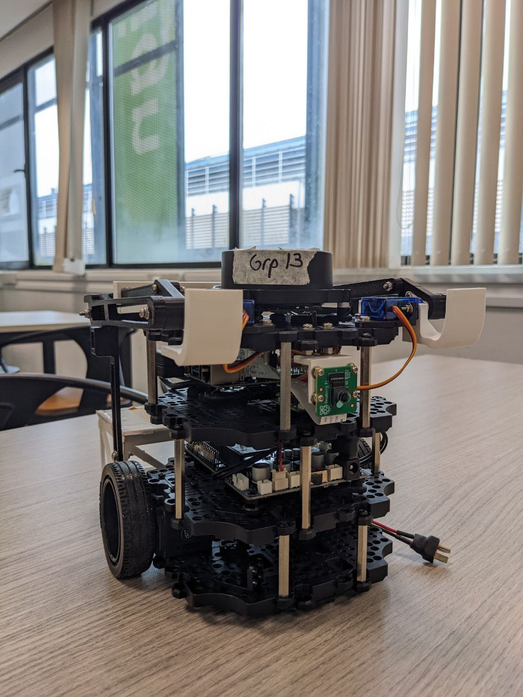
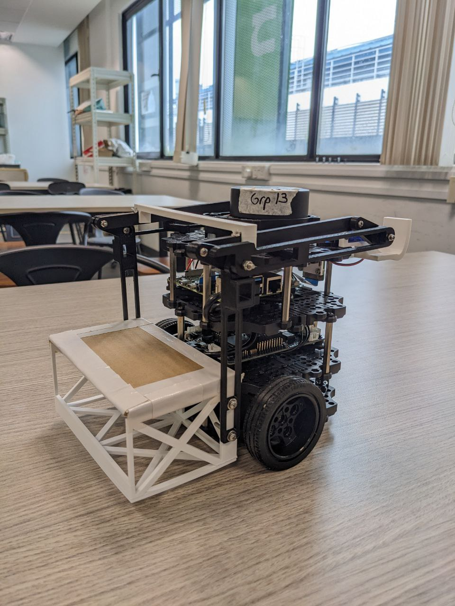

# EG2310 Group 13 Source Code

[Link to Mission README for AY23/24's mission](https://github.com/edic-nus/EG2310/blob/83657e38a5a4b31f4596f709c2ed182f1c063cbf/docs/MIssion%20Readme.md)

Front | Back
:-------------------------:|:-------------------------:
 | 

This repository contains the source code for our group's EG2310 robot. 

## Repository Structure
```bash
.
├── maze.py           # Overall mission code. Run with "ros2 run auto_nav maze"
├── costmap.py        # Publish costmap for use with A* algorithm. Run with "ros2 run auto_nav costmap"
├── jervin_rpicam.py  # View camera footage and adjust colour threshold. Run with "ros2 run auto_nav jervin_rpicam"
├── r2scanner.py      # Save LiDAR data to a .txt file. Run with "ros2 run auto_nav r2scanner"
├── package.xml       # Must be symlinked to ../ (should be in ~/colcon_ws/src/auto_nav/package.xml)
├── setup.py          # Must be symlinked to ../ (should be in ~/colcon_ws/src/auto_nav/setup.py)
├── assets                      # Folder containing reports, images, and other assets
├── lib                         # Folder for all functions
│   ├── bucket_utils.py         # Functions related to detecting and moving to bucket
│   ├── dumb_move.py            # Functions for moving and turning without relying on tf / SLAM data
│   ├── lobby.py                # Function for moving to the right spot in the lobby, before turning to the doors
│   ├── maze_manipulation.py    # Functions for map manipulation, such as costmap inflation
│   ├── occupy_nodes.py         # Functions for A* search and pathfinding
│   ├── open_door_http.py       # Function to execute HTTP call to the elevator server
│   ├── pid_tf2.py              # Functions for moving the robot based on SLAM TF data
│   ├── servo_client.py         # Client functions to activate servo on the robot
│   └── tf2_quat_utils.py       # Functions for quaternion manipulation
└── pytestfiles                 # Folder for various test functions and scripts
    ├── bucket_geogebra
    │   ├── geogebra-export.ggb # Import into GeoGebra Geometry for bucket detection math
    │   └── image.png
    ├── get_waypoints.py        # Testing file for simplifying A* generated path into straight line segments
    ├── houghlinemap.py         # Testing file for extracting straight line from generated path via hough line transform
    ├── lidar_visualise.py      # Visualise LiDAR data extracted from r2scanner
    ├── markerpublishtest.py    # Publish markers in RViz (such as coordinates from from get_waypoints)
    ├── outliers.py             # Testing file to remove outliers during bucket detection
    ├── pid_tf2_test.py         # Testing file when developing pid_tf2 move functions
    ├── rpi_publisher.py        # Script on RPi to publish camera feed to ROS2 topic
    ├── servo_bu.py             # Script on RPi to expose our servo mechanism as a ROS2 service
    ├── testingcostmap.py       # Testing file when developing costmap functions
    ├── testingdilate.py        # Testing file when developing dilation functions
    └── VoronoiRoadMap          # Testing folder when failing to use Voronoi generated paths
        └── ...
```

## Documentation
Documentation for individual functions can be found in the docstrings in each python file.
\<insert link to all our presentations and reports\>
